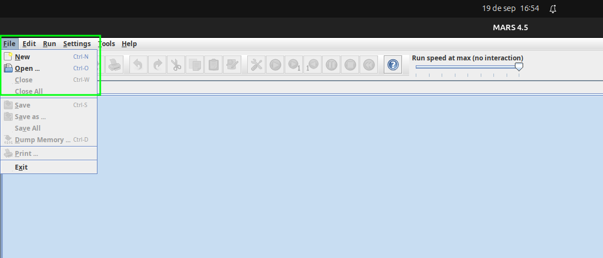

# Estructuras de Computadoras Digitales I de la Universidad de Costa Rica
Este repositorio contiene las 4 tareas desarrolladas durante el semestre para el curso IE0321. Cada tarea implementa algoritmos en lenguaje ensamblador MIPS, abordando conceptos fundamentales de arquitectura de computadoras.
Se utilizó el simulador Mars45, este simulador soporta archivos .asm y .s

## Instalación del simulador
Para poder ejecutar estos archivos se recomienda la herramienta Mars45, esta es un archivo .jar, por lo que solamente se necesita tener el Java Runtime Environment (JRE) actualizado. Para esto, se presenta las siguientes opciones:

### Windows y MAC:
Ingresar en el siguiente [link](https://www.java.com/es/download/manual.jsp)

### Linux (Ubuntu):
Colocar los siguientes comandos en la terminal:
```bash
sudo apt install default-jre
```
Y finalmente para verificar que se instaló correctamente, se puede utilizar el comando
```bash
java -version
```

## Ejecutar el archivo
Se abre el simulador y en la esquina izquierda superior se le da a file, luego open y se busca el archivo que se desea.


